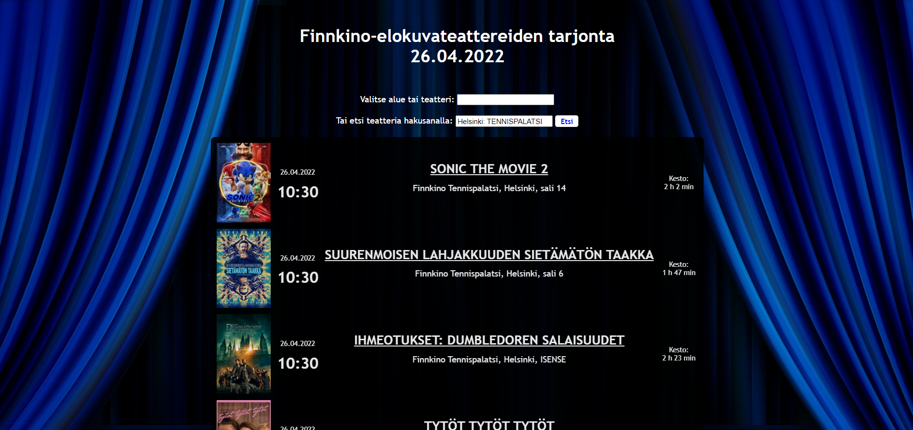

# Cinema Information App

## Project Description
Project 2 for *Dynamic Web Applications with JavaScript* course (Laurea UAS 5 ects). The aim was to develop a small-scale AJAX application using live REST API from Finnkino.

#### Requirements
- Application makes AJAX calls to a live REST API
- JavaScript and CSS kept in external files
- Only "native" JavaScript, no external libraries (JQuery etc.)
- Code is formatted and commented

## Features  
 :abc: User can choose an area or a specific cinema from a drop-down menu that lists the predefined options based on the user's data input   
 :mag_right: User can choose an area or a specific cinema by using custom search string field  
 :star: Search field recognizes some popular nicknames used for cinemas (such as *"Tennari"* for Helsinki Tennispalatsi or *"Omppu"* for Espoo Omena)  
 :exclamation: Empty or incorrect searches fire an alert box  
 :ticket: After a cinema has been successfully chosen, a schedule will be displayed with the following data: an image of the movie poster / text *"Image not found"*, date, starting time, movie title, auditorium details, and duration  
 :white_flag: In case there are no shows on the current date, user is informed by an alert box  
 :heavy_plus_sign: Clicking the poster image or movie title opens a link to the movie's synopsis page on Finnkino in a new tab  
 :top: "Scroll to top" button becomes visible and usable when the user scrolls down 20px from the top of the document

## How to Run
This application is published in Netlify: https://chic-empanada-4d3c94.netlify.app/

## Technologies
- JavaScript
- HTML
- CSS

## Reflection
This was a fun project! Much to my delight I was able to nail the main goal, code working AJAX calls, fairly quickly. :muscle::nerd_face: I was happy to spend extra time implementing additional features that I hadn't used before (e.g. "scroll to top" button and using datalist tag) just for the sake of learning.  
  
The decision to make the app in Finnish was not premeditated, but it turned out to be a valuable lesson on how umlauts create headache if you disregard the lang="fi" attribute in the html tag... :grimacing: Tried to, again, foresee possible scenarios and prevent errors (e.g. prevented the AJAX call from getting stuck with searching for an image tag that a new movie might not yet have in the XML). Found out by accident that Finnkino's REST API url works with arbitrary theatreIDs and had to find a way to make sure only intended IDs are being used to avoid confusing the user with erroneous results. Creating table data cells with different rowspans was quite a brain teaser but oh the joy I felt after making them align correctly! :partying_face:  
  
Inspired by an UX course I'm simultaneously enrolled on, *User-Centered Design of Digital Services* (Laurea UAS 5 ects), I went the extra mile to make the user experience more enjoyable. :blush: In addition to implementing the scroll button and the possibility to search for cinemas by their nickname, I also added these features:  
:thumbsup: on loading the page, the cursor jumps automatically to the drop-down menu to enable instant searches  
:thumbsup: the search field converts the user's string input to the cinema's real name to clarify which cinema the app interpreted the user meant  
:thumbsup: the movie duration data is converted from minutes to hours and minutes, and  
:thumbsup: when the user has already used the search field and wants to use the drop-down menu, the search field is emptied to avoid confusion on which search option's data is being displayed.  
